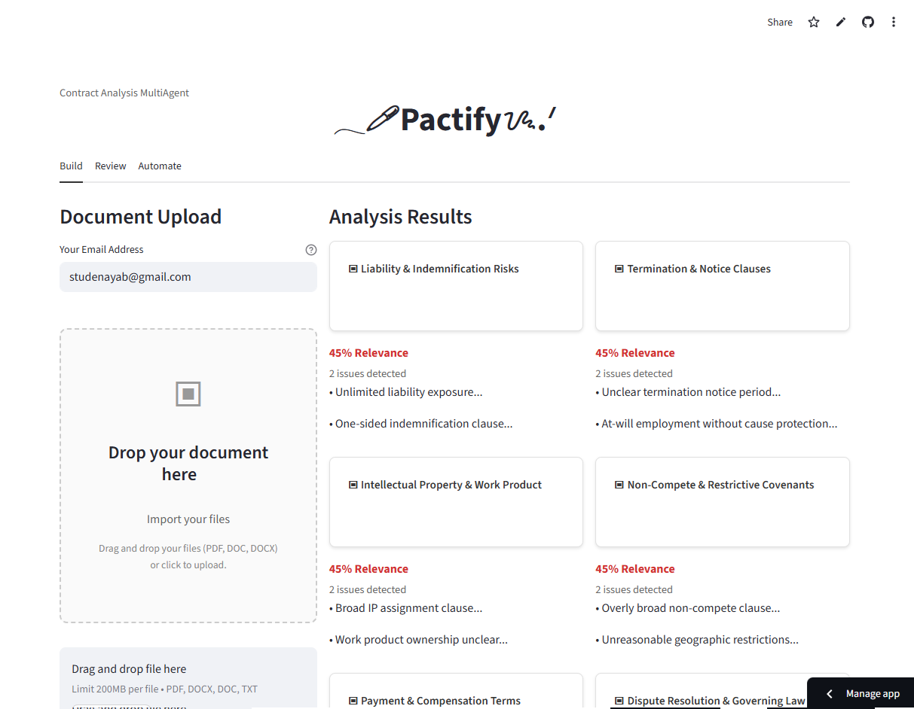
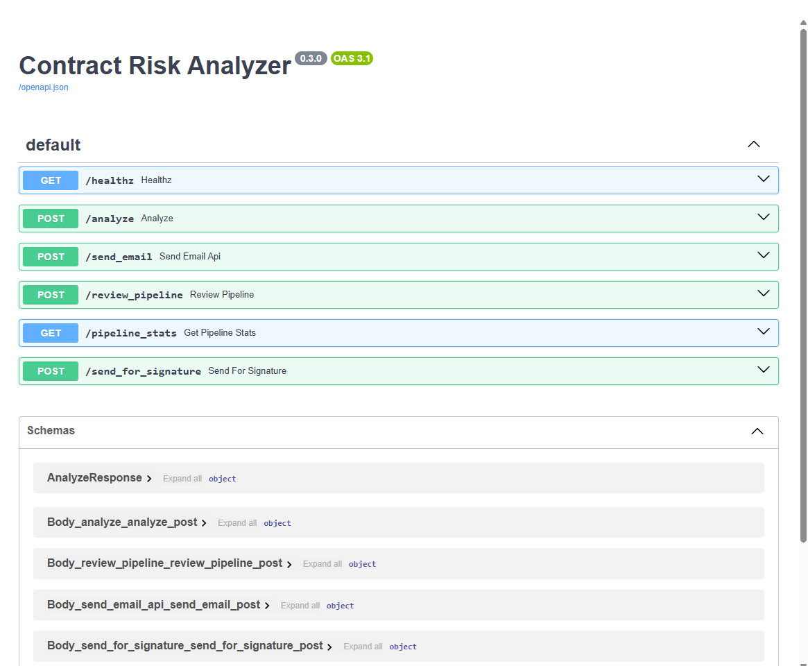
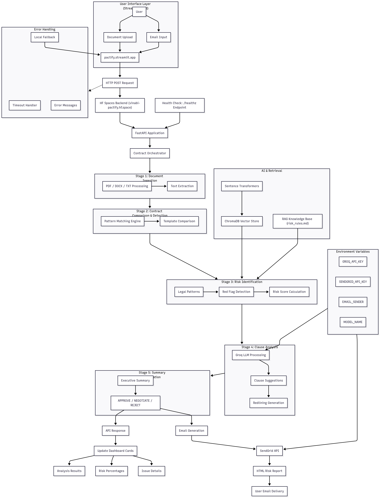

# **[↕Pactify](https://pactify.streamlit.app/)** : AI-Powered Contract Risk Analysis Platform

Pactify is a comprehensive contract risk analysis platform that combines artificial intelligence with legal expertise to automatically review, analyze, and flag potential risks in legal documents. The system employs a sophisticated 5-stage pipeline to process contracts and provide actionable insights to legal professionals.

## Architecture

### Frontend: Streamlit Cloud
- **Deployment URL**: `https://pactify.streamlit.app`
- **Technology**: Streamlit-based web application
- **Purpose**: User interface for document upload, analysis visualization, and results display

### Frontend


### Backend: Hugging Face Spaces
- **Deployment URL**: `https://vinabi-pactify.hf.space`
- **Technology**: FastAPI-based REST API
- **Purpose**: AI processing engine, contract analysis pipeline, email delivery

### Backend 


### Production Pipeline
This flow is a complete/production-ready, modular view of graph and nodes of whole workflow.


## Project Structure

```
pactify/
├── agents/                     # AI Agent Components
│   ├── contract_detector.py   # Document classification and validation
│   ├── graph.py               # Analysis workflow orchestration
│   ├── orchestrator.py        # Master pipeline coordinator
│   ├── pipeline.py            # Core analysis pipeline
│   ├── prompts.py             # AI model prompts and templates
│   ├── schemas.py             # Data validation schemas
│   ├── tools_docusign.py      # DocuSign integration (optional)
│   ├── tools_email.py         # SendGrid email functionality
│   ├── tools_parser.py        # Document parsing (PDF, DOCX, TXT)
│   └── tools_vector.py        # Vector database operations
├── api/                       # Backend API Layer
│   ├── main.py                # FastAPI application and endpoints
│   ├── models.py              # Pydantic data models
│   ├── settings.py            # Configuration management
│   └── utils.py               # Utility functions and helpers
├── app_ui/                    # Frontend Components
│   └── home.py                # Main Streamlit dashboard
├── knowledge/                 # Knowledge Base
│   └── risk_rules.md          # Legal risk assessment rules
├── ops/                       # Deployment Configuration
│   ├── docker-compose.yml     # Local development setup
│   ├── dockerfile.api         # API container configuration
│   └── dockerfile.ui          # UI container configuration
├── scripts/                   # Utility Scripts
│   └── ingest_risks.py        # Knowledge base ingestion
├── tests/                     # Test Suite
│   ├── sample_contracts/      # Test contract samples
│   └── test_api.py            # API endpoint tests
├── .streamlit/                # Streamlit Configuration
│   └── config.toml            # Theme and UI settings
├── Dockerfile                 # Hugging Face Spaces container
├── requirements.txt           # Python dependencies
└── streamlit_app.py           # Streamlit Cloud entry point
```

## 5-Stage Contract Analysis Pipeline

### Stage 1: Contract Ingestion
- **Purpose**: Document parsing and text extraction
- **Technologies**: PyPDF, python-docx, pdfplumber
- **Process**: Converts PDF, DOCX, and TXT files into analyzable text
- **Validation**: File format verification, content extraction validation

### Stage 2: Contract Comparison
- **Purpose**: Template matching and deviation detection
- **Technologies**: ChromaDB, sentence-transformers
- **Process**: Compares against standard contract templates
- **Output**: Contract type identification, deviation analysis

### Stage 3: Risk Identification
- **Purpose**: Red flag detection and risk scoring
- **Technologies**: Pattern matching, AI classification
- **Process**: Identifies liability, jurisdiction, payment, and compliance issues
- **Scoring**: 0-100 risk score based on severity and frequency

### Stage 4: Clause Suggestions
- **Purpose**: Improvement recommendations and redlining
- **Technologies**: LangChain, Groq LLM
- **Process**: Generates specific clause improvements
- **Output**: Redlined version with suggested changes

### Stage 5: Summary Generation
- **Purpose**: Executive summary and final recommendation
- **Technologies**: AI summarization, risk assessment
- **Process**: Consolidates findings into actionable report
- **Recommendations**: APPROVE, NEGOTIATE, or REJECT

## Dependencies

### Core AI and ML
- **langchain**: LLM orchestration and prompt management
- **langchain-groq**: Groq API integration for fast inference
- **sentence-transformers**: Semantic text embeddings
- **chromadb**: Vector database for similarity search
- **scikit-learn**: Machine learning utilities

### Document Processing
- **pypdf**: PDF text extraction
- **python-docx**: Microsoft Word document processing
- **pdfplumber**: Advanced PDF parsing with layout detection
- **pymupdf**: Alternative PDF processing engine

### Web Framework and API
- **streamlit**: Frontend web application framework
- **fastapi**: High-performance API framework
- **uvicorn**: ASGI server for FastAPI
- **pydantic**: Data validation and serialization
- **python-multipart**: File upload handling

### Communication and Integration
- **sendgrid**: Email delivery service
- **requests**: HTTP client for API communication
- **httpx**: Async HTTP client

### Data Processing
- **pandas**: Data manipulation and analysis
- **numpy**: Numerical computing
- **orjson**: Fast JSON serialization

### Development and Monitoring
- **loguru**: Advanced logging
- **python-dotenv**: Environment variable management

## Major Technical Challenges and Solutions

### Challenge 1: Streamlit-FastAPI Async Compatibility
**Problem**: Streamlit runs in a synchronous context, but the analysis pipeline uses async/await patterns, causing `RuntimeError: no running event loop` errors.

**Solution**: Created synchronous wrapper functions that avoid `asyncio.run()` within Streamlit's event loop. Implemented API-first architecture where Streamlit calls external FastAPI endpoints rather than importing async modules directly.

### Challenge 2: Cross-Platform Deployment Import Conflicts
**Problem**: Different deployment platforms (Streamlit Cloud vs Hugging Face Spaces) attempted to import incompatible modules, causing `ImportError` and `ModuleNotFoundError` exceptions.

**Solution**: Implemented platform-specific entry points:
- `streamlit_app.py` for Streamlit Cloud (UI-only)
- `app.py` for Hugging Face Spaces (API-only)
- Added conditional imports with try-catch blocks
- Created compatibility layers in `api/utils.py`

### Challenge 3: Document Type Detection Accuracy
**Problem**: Initial contract detection was too permissive, classifying non-legal documents (like `requirements.txt` or academic assignments) as contracts.

**Solution**: Developed sophisticated multi-stage detection algorithm:
- Pattern matching for legal terminology
- Structure analysis for contract elements
- Confidence scoring with configurable thresholds
- Context-aware rejection of technical/academic content
- Special handling for immigration forms and legal applications

### Challenge 4: Docker Build Failures on Hugging Face Spaces
**Problem**: Package installation failures due to missing system dependencies and incorrect base image selection.

**Solution**: Optimized Dockerfile with:
- Proper base image selection (`python:3.11-slim`)
- System dependency management
- Multi-stage build process
- Health check configuration for container orchestration

### Challenge 5: Real-time Analysis Results Display
**Problem**: Dashboard cards losing shape on page refresh and placeholder data not updating with actual analysis results.

**Solution**: Implemented state management system:
- Persistent session state in Streamlit
- Dynamic card rendering with consistent structure
- Real-time progress indicators during processing
- Proper error handling and fallback displays

### Challenge 6: Email Integration and File Attachment Handling
**Problem**: SendGrid integration failures and file attachment encoding issues.

**Solution**: Robust email system with:
- Base64 encoding for file attachments
- HTML email template generation
- Error handling and retry logic
- Comprehensive logging for debugging

## Local Development Setup

### Prerequisites
- Python 3.11 or higher
- Git
- Text editor or IDE

### Step-by-Step Installation

1. **Clone the Repository**
```bash
git clone https://github.com/vinabi/pactify.git
cd pactify
```

2. **Create Virtual Environment**
```bash
python -m venv venv
# Windows
venv\Scripts\activate
# macOS/Linux
source venv/bin/activate
```

3. **Install Dependencies**
```bash
pip install -r requirements.txt
```

4. **Environment Configuration**
Create `.env` file in project root:
```env
GROQ_API_KEY=your_groq_api_key_here
SENDGRID_API_KEY=your_sendgrid_api_key_here
EMAIL_SENDER=your_verified_sender_email@domain.com
CHROMA_DIR=.chroma
CORS_ALLOW_ORIGINS=*
MAX_FILE_MB=10
MAX_CLAUSES=300
```

5. **Initialize Knowledge Base**
```bash
python scripts/ingest_risks.py
```

6. **Run Backend API (Terminal 1)**
```bash
uvicorn api.main:app --reload --host 127.0.0.1 --port 8080
```

7. **Run Frontend UI (Terminal 2)**
```bash
streamlit run app_ui/home.py --server.port 8501
```

8. **Access Application**
- Frontend: `http://localhost:8501`
- Backend API: `http://localhost:8080`
- API Documentation: `http://localhost:8080/docs`

### Testing
```bash
python -m pytest tests/ -v
```

## Production Deployment

### Streamlit Cloud Deployment

1. **Repository Preparation**
   - Ensure `streamlit_app.py` exists in repository root
   - Configure `.streamlit/config.toml` for theming
   - Add `requirements.txt` with Streamlit dependencies

2. **Streamlit Cloud Setup**
   - Visit `https://share.streamlit.io`
   - Connect GitHub repository
   - Select `streamlit_app.py` as main file
   - Configure environment variables in Streamlit dashboard
   - Deploy and obtain public URL

3. **Environment Variables for Streamlit Cloud**
   - Set API endpoint to Hugging Face Space URL
   - Configure any necessary API keys
   - Ensure CORS settings allow cross-origin requests

### Hugging Face Spaces Deployment

1. **Space Creation**
   - Create new Space on Hugging Face Hub
   - Select "Docker" as Space type
   - Clone repository to Space

2. **Docker Configuration**
   - Ensure `Dockerfile` is configured for FastAPI/uvicorn
   - Set proper port exposure (7860 for HF Spaces)
   - Configure health checks

3. **Environment Variables for HF Spaces**
   ```
   GROQ_API_KEY=your_groq_api_key
   SENDGRID_API_KEY=your_sendgrid_key
   EMAIL_SENDER=your_email@domain.com
   ```

4. **Deployment Process**
   - Push code to HF Space repository
   - Space automatically builds Docker container
   - Monitor build logs for any errors
   - Test API endpoints once deployment completes

### Production Architecture Flow

1. User uploads document via Streamlit Cloud frontend
2. Frontend sends HTTP request to HF Spaces backend API
3. Backend processes document through 5-stage pipeline
4. Analysis results returned to frontend for display
5. Email report automatically sent to user
6. Results cached in frontend session state

## API Endpoints

### Health Check
- **GET** `/healthz`
- **Purpose**: Service health verification
- **Response**: `{"status": "ok"}`

### Contract Analysis
- **POST** `/analyze`
- **Purpose**: Single contract analysis
- **Parameters**: file, strict_mode, jurisdiction, top_k_precedents
- **Response**: Detailed analysis with risk scores and recommendations

### Complete Pipeline
- **POST** `/review_pipeline`
- **Purpose**: Full 5-stage pipeline execution
- **Parameters**: file, requester_email, jurisdiction, strict_mode
- **Response**: Summary with email delivery confirmation

### Email Delivery
- **POST** `/send_email`
- **Purpose**: Manual email sending
- **Parameters**: to_email, subject, body, file (optional)
- **Response**: Delivery status confirmation

### Pipeline Statistics
- **GET** `/pipeline_stats`
- **Purpose**: Processing metrics and performance data
- **Response**: Success rates, processing times, error counts

## Configuration Options

### Streamlit Configuration (`.streamlit/config.toml`)
```toml
[theme]
primaryColor = "#333333"
backgroundColor = "#FFFFFF"
secondaryBackgroundColor = "#F0F2F6"
textColor = "#262730"

[server]
headless = true
enableCORS = false
```

### API Configuration (`api/settings.py`)
- **GROQ_API_KEY**: AI model access token
- **SENDGRID_API_KEY**: Email service authentication
- **EMAIL_SENDER**: Verified sender email address
- **CHROMA_DIR**: Vector database storage location
- **CORS_ALLOW_ORIGINS**: Cross-origin request permissions
- **MAX_FILE_MB**: Maximum upload file size
- **MAX_CLAUSES**: Analysis output limit

## Monitoring and Logging

### Application Logs
- **Backend**: Structured logging via loguru
- **Frontend**: Streamlit native logging
- **Deployment**: Platform-specific log aggregation

### Error Tracking
- Comprehensive exception handling
- User-friendly error messages
- Debug information for development
- Performance metrics collection

### Health Monitoring
- API health check endpoints
- Container health checks
- Service availability monitoring
- Response time tracking

## Security Considerations

### Data Protection
- No persistent storage of uploaded documents
- Temporary processing only
- Secure file upload validation
- Content sanitization

### API Security
- CORS configuration for cross-origin requests
- File type validation and size limits
- Input sanitization and validation
- Rate limiting considerations

### Environment Security
- Environment variable management
- API key rotation capabilities
- Secure credential storage
- Access logging and monitoring

## Future Enhancements

### Planned Features
- DocuSign integration for electronic signatures
- Advanced contract template library
- Multi-language contract support
- Batch processing capabilities
- Advanced analytics and reporting
- User authentication and authorization
- Contract version comparison
- Integration with legal practice management systems

### Technical Improvements
- Performance optimization for large documents
- Enhanced AI model fine-tuning
- Real-time collaboration features
- Mobile-responsive design improvements
- Advanced caching strategies
- Microservices architecture migration

## Support and Maintenance

### Documentation
- API documentation available at `/docs` endpoint
- Inline code comments for maintainability
- Architecture decision records
- Deployment runbooks

### Contributing
- Code style: Black formatter, flake8 linting
- Testing: pytest with comprehensive coverage
- Version control: Git with semantic versioning
- Code review: Pull request workflow

### Troubleshooting
- Common issues documented in repository wiki
- Debug mode available for development
- Comprehensive logging for issue diagnosis
- Community support via GitHub issues

This comprehensive documentation provides everything needed to understand, deploy, and maintain the Pactify contract analysis platform. The system represents a sophisticated integration of AI technology with practical legal document processing needs, solving real-world challenges in contract review and risk assessment. HUMAN REVIEW IS SURE THING.

#### If you find this project helpful, don’t forget to star the repo! 🎀
